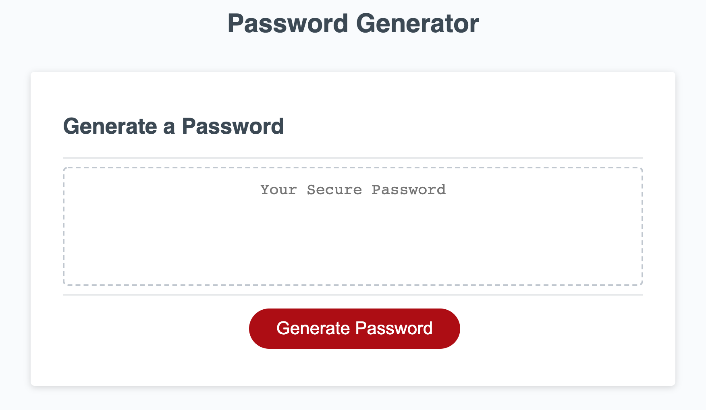
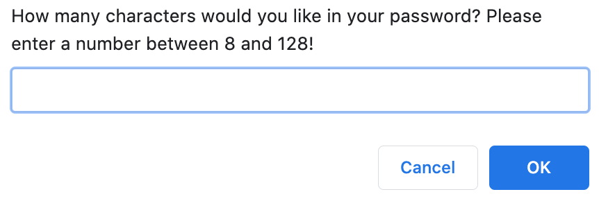
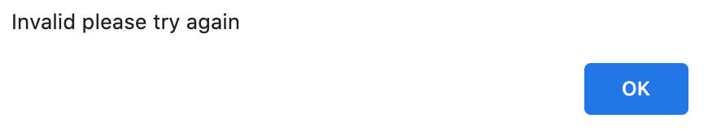
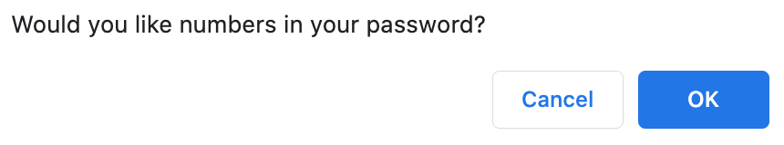
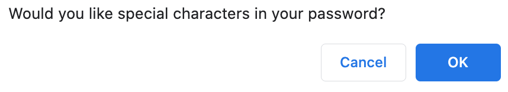
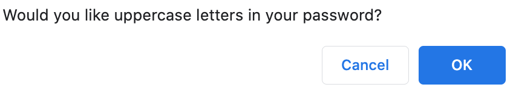
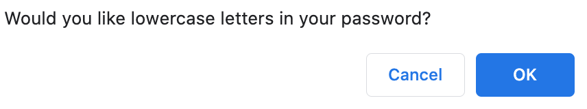
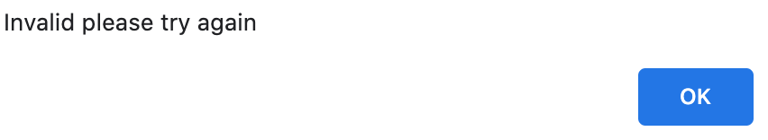
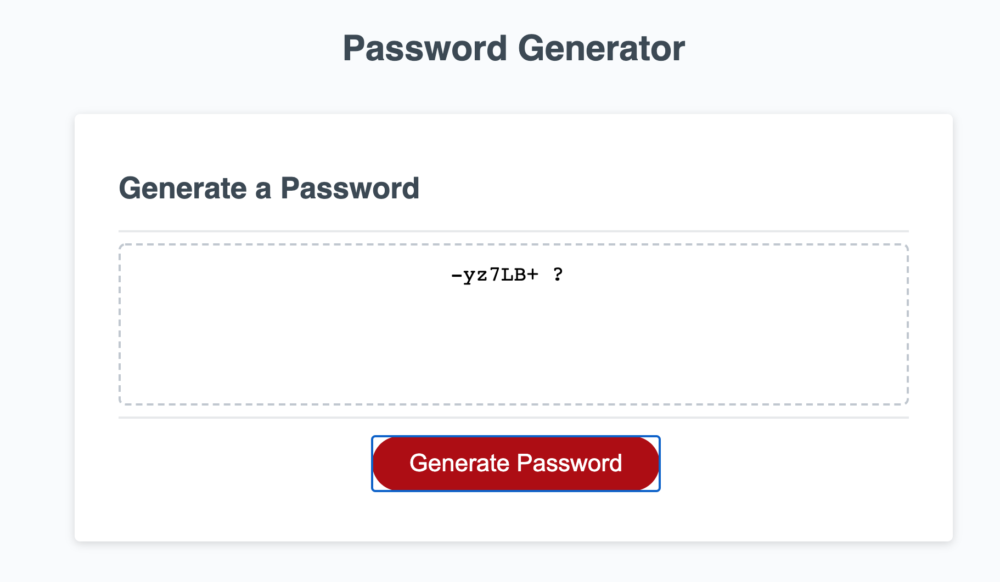

# PasswordGenerator

## Description: 

Modified starter code to create an application that enables employees to generate a random password based on the criteria they select.

Upon clicking the link to the deployed page the user is presented with a series of prompts. 

The first prompt in the series request that the user input a number between 8 and 128 to set the password length. 

If the user inputs a number that is either less than 8 or larger than 128 the user will receive an alert informing them that the number submitted is invalid.  

After the initial prompt the user is prompted four (4) separate times for the following criteria: 
- numbers

  

- special characters 

  

- uppercase 

  

- lowercase 

  

If the user declines to accept any of the aforementioned criteria prompts they will receive an alert stating that their response is invalid. 

If the user inputs an appropriate password length and accepts all the required criteria a password will generate. 

## Process: 

I began this project by writing out pseudo-code to provide a general outline for solving the issue.  
Then I started adding code to the page to see what worked and what didn't. 

After many hours of trial and error on top of a mountain of Google searches and questions for tutors, I was able to find a solution and create a password generator. 

## Link to deployed application:

https://doublelforce5.github.io/PasswordGenerator/
